### Hi there 👋
- 🔭 造轮中: Quant Framework
- 🌱 常用语言: python, rust, golang, java, javascript
- 💬 我的方向: 量化交易/神经网络
- 📫 QQ: 1626666628 E-mail: admin@660.moe
### 量化交易:
- 消息网关网关: https://github.com/QuantRS/qgateway
- 消息网关客户端: https://github.com/QuantRS/qgateway_client
- 消息网关python客户端: https://github.com/QuantRS/qgateway_client_pywrap
### Minecraft项目:
- 游戏世界服务器框架: https://github.com/qsxzaqq/GameCraftFramework
- 不知名(破)签到: https://github.com/qsxzaqq/qiandao

